# My-Kubernetes-Notes
Listing my [Kubernetes](https://kubernetes.io/docs) Notes. It will cover notes that I took from this Udemy Course(https://www.udemy.com/course/kubernetes-temelleri/).

# Introduction

1) You can access the configuration files via [here](https://github.com/aytitech/k8sfundamentals).

2) Some K8s Distributions

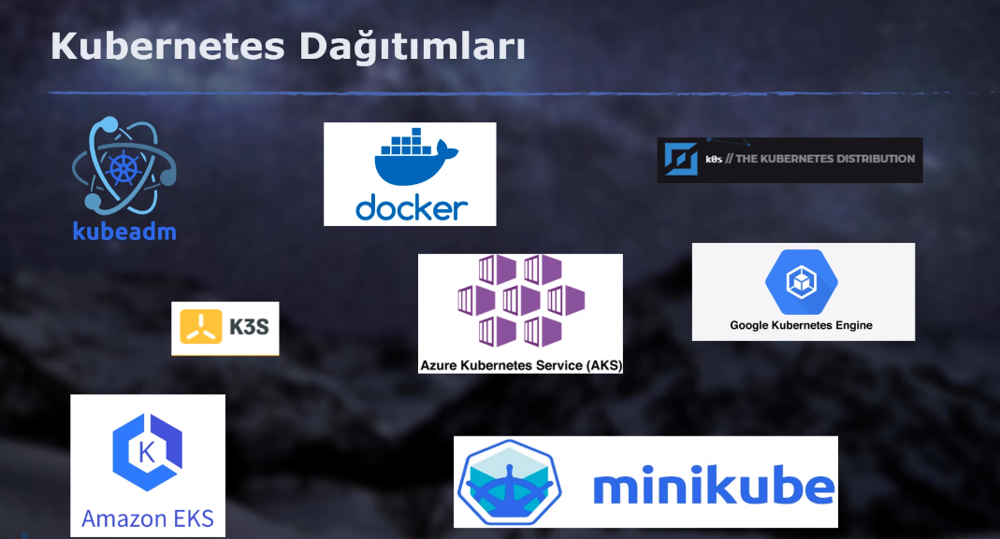

3) Install kubernetes extension of Microsoft and Yaml extension of Redhat on Visual Studio Code.

4) K8s is highly complex.

5) K8s is a container orchestration tool. It isn't a container engine tool. Docker, containerd and cri-o are [container engines](https://phoenixnap.com/kb/docker-vs-containerd-vs-cri-o) that k8s supports.

# Kubernetes Architecture

1) Some Container Orchestration Tools are Docker Swarm, Kubernetes, Apache Mezos & Hashicorp Nomad. K8s became industry-standard. K8s has Apache 2.0 LICENSE. K8s has declerative configuration.

2) Cgroups development made by Google Engineers made containers possible.

3) Omega and Borg are 2 container orchestration tools developed by Google. They aren't open source and exist before k8s.

4) Google gave K8s to [CNCF](https://cncf.io).

5) The reasons why k8s became so popular are its design & its approach to solve the problem of container orchestration. K8s is modular. It has different components. We shouldn't tell k8s how to do. We should tell k8s what to do. Memorize carpenter analogy.

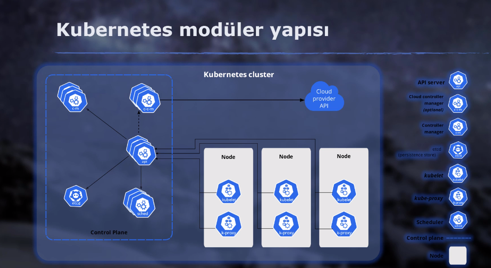

6) K8s has a platform that has many multiple services(components).

7) K8s architecture is below. The left half is Master Node and the right half is Worker Nodes.

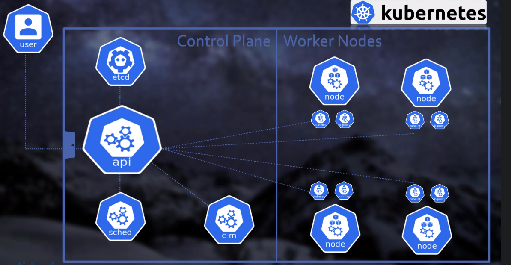

8) Some k8s components:
    - kube-apiserver
    - etcd
    - kube-scheduler 
    - kube-control-manager
    - cloud controller manager

8) kube-apiserver is the most important k8s server. It can be thought as brain of K8s. It is communicating with external services and all components of k8s. All connections happen through kube-apiserver. It is a common entry-point of external services and all components of k8s. kube-apiserver is a REST API Server.

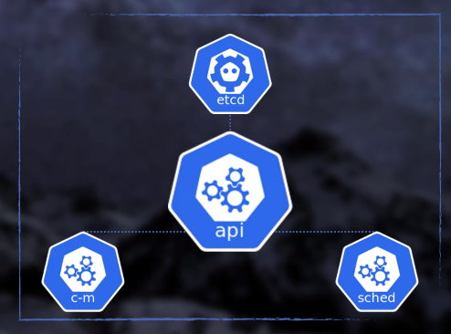

9) etcd is the second most important k8s component after kube-apiserver. It stores all cluster data, metadata information & k8s objects' information. Etcd generally is located in where kube-apiserver runs.

10) kube-scheduler is another component of k8s, which is responsible for assiging pods(~containers) to nodes(VM's).

11) kube-control-manager is tracking the system and triyng to keep desired state. Let's assume we want  our app to run on 3 pods. One pod dropped unknowingly. kube-control-monager checks data on etcd and tries to keep the number of pods as 3 by trigerring the creation of one new pod.

12) There is a component named cloud controller manager. This components exists among managed cloud k8s services on AWS, Azure and GCP.

13) kube-apiserver, etcd, kube-scheduler and kube-control-manager are known as control plane and working on master node. Master nodes have a taint named __node-role.kubernetes.io/master:NoSchedule__.

14) Workload doesn't run on master nodes. Master nodes can be one or many.

15) Worker nodes have container runtime such as docker, containerd, cri-o. Each worker node has 3 main components:
    - Container runtime: Docker as default. Kubernetes stopped supporting docker runtime due to some reasons. Thus, k8s moved to containerd as of k8s 1.20.1 .
    - Kubelet: Checks etcd through API Server. Responsible for creating pods if kube-scheduler orders.
    - kube-proxy: Manages TCP, UDP SETP rules and network traffic of pods. It works as network proxy.

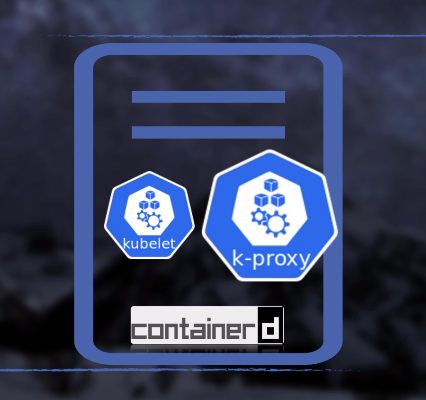

16) K8s follows semantic versioning(x.y.z-major.minor.patch). Minor upgrades come once in 4 months. The support lasts for 12 months.

17) Some resources:
    - [https://kubernetes.io/docs](https://kubernetes.io/docs)
    - [https://github.com/kubernetes/kubernetes](https://github.com/kubernetes/kubernetes)

# Kubernetes Installation

1) There are 3 ways to communicate with API Server

    - REST Calls(via curl or via program)
    - GUI(official dashboard is Kubernetes Dashboard, Lens, Octant etc.)
    - CLI( kubectl )

2) Install kubectl via [instruction listed here](https://kubernetes.io/docs/tasks/tools/install-kubectl-linux/)

3) Chocolatey is a package manager for Windows. It does what MacOS's Homebrew does.

4) We can install kubectl via snap or brew. To check the version of kubectl, run the following:

```version.sh
kubectl version --client
```

5) minikube and Docker Desktop should be used for development and testing purposes.

6) kubeadm is semi-official version K8s for production purposes. There are more k8s packages for production like k0s, kubespray, RKE. There are spported and paid k8s solutions from enterprise companies.

7) Public cloud managed K8s solutions exist among AWS(EKS - Elastic Kubernetes Service), Azure(AKS - Azure Kubernetes Service) and GCP(GKE - Google Kubernetes Engine).

8) We can install a single-node k8s via Docker Desktop. In order to install Docker Desktop, we should enable virtualization first for our OS. We can enable k8s on Docker Desktop. After enabling k8s on Docker Desktop, we can see that Server Version is also enabled.

9) [Minikube](https://minikube.sigs.k8s.io/docs/start/) is preferred over Docker Desktop. Docker Desktop is not available on Linux. Minikube is installing a single-node k8s cluster locally. We can change it to multi-nodes later in Minikube.

10) In order to install Minikube, docker or podman or VMWare or Hyper-V should exist in our computer.

11) We can start a k8s cluster via the command below

```start.sh
# To start with default driver(probably docker)
minikube start
# To start with a different driver
minikube start --driver=vmware
minikube start --driver=podman
# To add a new node to a k8s cluster
minikube node add
# To start a k8s cluster with 5 nodes(1 master node, 4 worker nodes)
minikube start --node=5
```

12) To check status of k8s cluster triggered via minikube,

```status.sh
minikube status
```

    - minikube
    - type: Control Plane
    - host: Running
    - kubelet: Running
    - apiserver: Running
    - kubeconfig: Configured

13) To list nodes of k8s cluster

```list.sh
kubectl get nodes
# an abbreviation
kubectl get no
```

14) To purge k8s cluster

```delete.sh
minikube delete
```

15) To stop a existing k8s cluster without deleting

```stop.sh
minikube stop
```

16) Azure is providing 200$ free credit for one month. We don't pay for master node in AKS. We just pay for worker nodes. In order to use AKS from local computers, we should install Azure CLI in our local computers. After installing CLI, run `az login` on Terminal and enter the credentials. To list resource groups, run `az group list` or `az group list -o table`. To bind our kubectl to AKS, trigger `az aks get-credentials --name NAME_OF_K8S_ON_AZ --resource-group RESOURCE_GROUP_OF_AKS_CLUSTER`. After completing our job, we should delete AKS cluster on Azure.

17) GCP is proving GKE(Google Kubernetes Engine). Download and install GCP's CLI. Then connect our CLI to GCP. Then, connect to GKE on GCP. No master node fees exist. Only paying for worker nodes.

18) AWS EKS is charging money for master nodes unlike Azure and GCP. Install AWS CLI and connect kubectl to remote EKS cluster. Creating nodes in AWS for EKS takes so much time.

## kubeadm

19) kubeadm is a way to create k8s clusters efficiently using following best practices. We can use kubeadm to create a cluster composed of many machines(Bare metal, VM's, Cloud VM's, Rasperry pi etc)

20) [multipass.run](https://multipass.run) by Canonical is a way to run ubuntu VM's using CLI easily. It is required to have Hyper-v or VirtualBox among our system. Multipass faciliates creating processes of VM's.

21) Windows 10 Pro/Enterprise and Education have Hyper-V by default.

22) Follow the instructions [here](https://github.com/aytitech/k8sfundamentals/tree/main/setup) and set up a k8s cluster on local machine using kubeadm. 

23) `multpass shell MACHINE_NAME` is a way to connect to the multipass instance.

24) Some components of k8s are working on containers too. Api-server, controller-manager, kube-scheduler, kube-proxy are pulled from container registry platform and running on docker containers to make up of k8s.

25) The machine where `sudo kubeadm init` is triggered is the master node of k8s cluster.

26) When we set up a cluster, it is required to install a plug-in to manage the network. The most famous one is [Calico](https://docs.tigera.io/calico/latest/getting-started/kubernetes/).

27) We can use [play-with-k8s](https://labs.play-with-k8s.com/) to use k8s if we can't install k8s on local computer os we can't use cloud services.

# Kubernetes 101

1) The default config file of kubectl is ~/.kube/config. We can connect to many k8s cluster by configuring config file. We can connect to the same cluster via different users.

```config
apiVersion: v1
clusters:
- cluster:
    certificate-authority: /home/muhammed/.minikube/ca.crt
    extensions:
    - extension:
        last-update: Sat, 29 Apr 2023 13:59:26 +03
        provider: minikube.sigs.k8s.io
        version: v1.30.1
      name: cluster_info
    server: https://192.168.49.2:8443
  name: minikube
contexts:
- context:
    cluster: minikube
    extensions:
    - extension:
        last-update: Sat, 29 Apr 2023 13:59:26 +03
        provider: minikube.sigs.k8s.io
        version: v1.30.1
      name: context_info
    namespace: default
    user: minikube
  name: minikube
current-context: minikube
kind: Config
preferences: {}
users:
- name: minikube
  user:
    client-certificate: /home/muhammed/.minikube/profiles/minikube/client.crt
    client-key: /home/muhammed/.minikube/profiles/minikube/client.key

```

2) A config file composed of many contexts below. Contexts are created via joining users, connection information and namespaces(maybe)

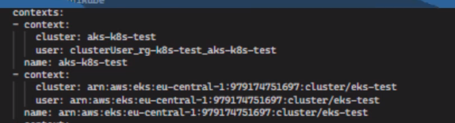

3) A config file mainly is composed of 3 components: clusters, contexts, users.

4) To list commands available with kubectl, run `kubectl config`.

5) To list available contexts, run `kubectl config get-contexts`. 

6) There can be many contexts but one of them can be used at the same time. The commands that we entered are run on current context. To see the current context, run the following

```shellscript
kubectl config current-context
```

7) To switch context

```shellscript
kubectl config use-context CONTEXT_NAME_TO_CHANGE
```

8) To learn information of cluster

```shellscript
kubectl cluster-info
```

9) To learn more about a kubectl command, use `--help` flag. An example is `kubectl cp --help`.

10) The general pattern of kubectl is `kubectl ACTION OBJECT_TYPE OBJECT_NAME`. An example is `kubectl delete pods my-pod-1`. The example will delete the pod named my-pod-1.

11) To remove an object, run `kubectl delete pods testpod`.

12) If we don't specify namespace, the default namespace will be chosen. We can specify the namespace via `-n NAMESPACE_NAME`. An example is `kubectl get pods -n kube-system`.

13) To list pods in all namespaces, trigger `kubectl get pods --all-namespaces` or `kubectl get pods -A`.

14) To change the outpur format of kubectl command, enter `-o OUTPUT_FORMAT`. An example is `kubectl get pods -o wide`. `json`, `yaml`, `jsonpath`, `go-template`, `ysjon`, `custom-columns` are other output formats.

15) `jq` is a program on linux, running on Terminal.

16) If we want to learn more about a k8s object, we can use `kubectl explain OBJECT_TYPE`. An example is `kubectl explain pod` or `kubectl explain deployment`.

## K8s objects

17) Different K8s objects are below:

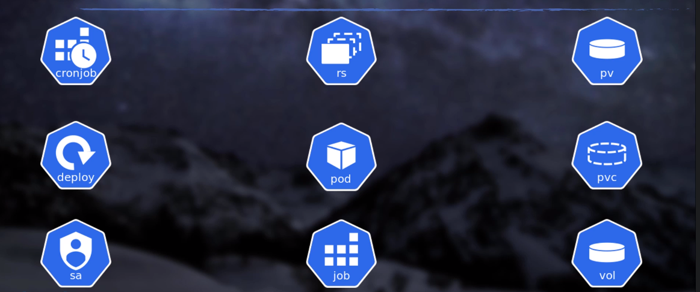

18) Pod is the most basic object. It is the smallest object in k8s. Pod can have 1 or many containers at the same time. In 99% of cases, one pod has one container. Each pod has a unique identifier(UID) and a unique localhost. Contaiers which are in the same pod are run in the same worker node. Look at **files/pods/base.yaml**.

19) To create a pod in k8s

```shellscript
kubectl run POD_NAME_HERE --image=IMAGE_NAME_HERE
```

20) The status of all pods. READY means how many containers are running in the pod. NODE shows us on which node the pod is running.

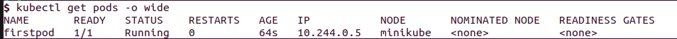

21) To learn more about a specific pod, we can use `kubectl describe OBJECT_TYPE OBJECT_NAME`. An example is `kubectl describe deployments mydeployment`.

```shellscript
kubectl describe pods POD_NAME
```

22) To see logs of a pod

```shellscript
kubectl logs POD_NAME

# For live tracking
kubectl logs -f POD_NAME
```

23) To run a command inside a pod

```shellscript
# hostname command triggered on pod named firstpod
kubectl exec POD_NAME -- hostname
# ls command triggered
kubectl exec POD_NAME -- ls /
```

24) To enter inside a pod, run the following

```shellscript
kubectl exec -it POD_NAME -- /bin/sh
# if there are more than 1 container in a pod, specify the container via "-c CONTAINER_NAME".
kubectl exec -it POD_NAME -c CONTAINER_NAME -- /bin/sh
```

25) To delete a pod

```shellscript
kubectl delete pods POD_NAME
```

26) We don't create pods using typing commands generally. We use YAML files among k8s. THe advantage of using yaml files is to keep track using **git**. YAML is preferred over JSON. Indentation cares in YAML. 2 or 4 spaces are possile but choose one of them.

27) **apiVersion**, **kind** and **metadata** are 3 mandatory keys texisting in definitions of k8s objects. They have to exist. **spec** also exists among most of the objects but it is not mandatory. **kind** means what type of object to create(pod, service or deployment). apiVersion can be detected by triggering `kubectl explain OBJECT_TYPE` or `kubectl explain pod`. **metadata** means unique identifiers that we specify for this object. **metadata** isn't taking a single string value like **apiVersion** or **kind**. **metadata** is a dictionary. **metadata** takes __name__, __namespaces__, __annotations__, __labels__.

```objectbasetemplate.yaml
apiVersion: v1
kind: Pod
metadata:
  name: firstpod
  labels:
    app: frontend
spec:
  containers:
    - name: nginx
      image: nginx:latest
      ports:
      - containerPort: 80
      
```

28) To create a pod using yaml file, trigger `kubectl apply -f pod1.yaml`. Take a look at **files/pods/pod1.yaml**.

29) `kubetctl edit pods firstpod` is a way to make a change on an existing object(the object is pod here). This way isn't recommended. Using YAML files in git is more preferrable.

30) Lifecycle of a pod

  - Send yaml file to API Server
  - API Server assigns unique ID to pod and saves this information on etcd.
  - Pod created but its status is pending.
  - Kube-scheduler checks etcd and chooses the most appropriate worker node for the pod.
  - Pod passes to the status of creating.
  - kubelet(working on worker node) checks etcd and creates containers(pod).

31) Containers in a pod have a restart policy. It is one of these: **Always** | **On-failure** | **Never**. The default is Always. __restartPolicy__ in a yaml file should be set under **spec**.

32) ImagePullBackOff is an error message meaning that an error occured while pulling the image to make up a pod. It is probably due to a typo or a connection error. CrashLoopBackOff is an error message meaning that an error occurred while creating the containers of a pod.

33) `-w` can be appended to the end of any kubectl command. `-w` means watch what is going on. `kubectl get pods -w` is an example.

### Multi Containers Pod

34) One pod may have multiple containers. This is useful when tracking application(fluentd, sentry etc) tracks our main application(Django, Spring Boot etc). fluentd is a well-known log collection application in k8s world. Containers which are in the same pod can connect to each other via localhost. Their IP addresses are the same. No configuration needed. One volume can be mounted to both containers which are in the same pod. **files/pods/podmulticontainer.yaml**

35) Sidecar container is the second container in a pod if it exists. Related to above point(34).  

36) There is another way to create a second container in a pod. It is called **init container**. It is called at the beginning phase of pod creation. After it works, it is destroyed and the main container is created secondly. An example init container is that the app which is in init container pulls latest configurations from a source and makes is ready for app container. Take a look at **files/pods/podinitcontainer.yaml** .

### Labels & Selectors

37) labels can be assigned to different types of objects in k8s. They work through key-value pairs. One example label is **team: development**. They can be assigned during the creation phase of objects or after the creation phase. This way is more declarative. The connections between objects are built via labels among k8s. Service and Deployment objects determine which pods to connect via labels.

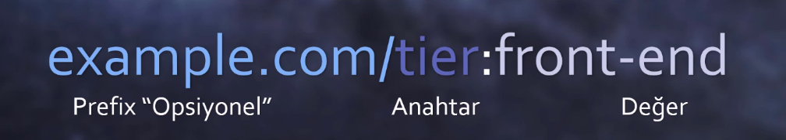

38) It is a good practice to have a separate file for each k8s object. However, we can have multiple configuration files for multiple objects in a single file by putting a `---` between definitions. Take a look at **files/pods/podinitcontainer.yaml**.

39) Selector is to filter all pods having labels whose key is app. It is used in binding objects to each other. Selector is so important.

```shellscript
# the pods having app key value
kubectl get pods -l "app" --show-labels
# the pods having app=firstapp
kubectl get pods -l "app=firstapp" --show-labels
# the pods having app=firstapp and tier=frontend
kubectl get pods -l "app=firstapp,tier=frontend" --show-labels
# the pods having app=firstapp and tier!=frontend
kubectl get pods -l "app=firstapp,tier!=frontend" --show-labels
# the pods having app key and tier=frontend
kubectl get pods -l "app=firstapp,tier=frontend" --show-labels
# the pods having app key=
kubectl get pods -l "app=firstapp" --show-labels
# set based syntax, app=firstapp
kubectl get pods -l 'app in (firstapp)' --show-labels
# app != firstapp
kubectl get pods -l 'app notin (firstapp)' --show-labels
# app should exist but app != firstapp
kubectl get pods -l 'app, app notin (firstapp)' --show-labels
# app is either firstapp or secondapp
kubectl get pods -l 'app in (firstapp, secondapp)' --show-labels
# app key not existing
kubectl get pods -l '!app' --show-labels
```

40) To assign a label(app=thirdapp) to an existing pod

```shellscript
kubectl label pods POD_NAME app=thirdapp
# To assign a label named hddtype=ssd to a node named minikube
kubectl label nodes minikube hddtype=ssd
```

41) To delete a label(whose key is app) from an existing pod

```shellscript
kubectl label pods POD_NAME app-
```

42) To update a label of a pod(it was app=thirdapp but now app=fourapp)

```shellscript
kubectl label --overwrite pods POD_NAME app=fourapp
```

43) To add a label(foo=bar) to all pods

```shellscript
kubectl label pods --all foo=bar
```

44) labels enable us to bind objects to each other. We can decide where to create a pod using labels. We can assign pods requiring fast I/O operations to SSD's and pods not requiring fast I/O operations to HDD's.

45) To delete all objects created by a YAML file

```shell
kubectl delete -f YAML_FILE.yaml
```

### Annotations

46) Annotation is another way to append metadata as label. It is used in where we can't apply label.

47) Annotations are defined under metadata in yaml file. This is similar to labels.

48) We can add annotations imperatively or declaratively. Its syntax is similar to labels.

### Namespaces

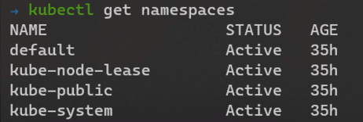

49) Namespaces are k8s objects too. Namespaces are similar to folders for file servers. Namespace is a way to split k8s cluster into multiple users. Let's assume we have a k8s cluster composed of 18 VM's. We want to allocate 10 machines to team 1, 6 machines to team 2, 2 machines to team 3. We can do this via namespaces.

50) Namespaces are used for 2 purposes: Limiting resources and arranging accesses.

51) When a k8s cluster is set up, 4 namespaces are created. **kube-node-lease**, **kube-public**, **kube-system** are 3 namespaces that deal with k8s configurations. **default** is the default namespace on which k8s objects are created if we specify otherwise.


52) To list namespaces

```shell
kubectl get namespaces
```

53) To list pods in a specific namespace

```shell
kubectl get pods --name NAMESPACE_NAME
kubectl get pods --n NAMESPACE_NAME
# to list all pods in all namespaces
kubectl get pods --all-namespaces
# To list all objects in a namespace
kubectl get all -n ingress-nginx
```

54) To create a namespace

```shell
kubectl create namespace NAMESPACE_NAME_TO_CREATE
```

55) We can define namespaces in yaml files declaratively. Look at **files/pods/podnamespace.yaml** . It creates a namespaces named development and creates a pod who is binded to development namespace.

56) To change namespace for kubectl to development namespace

```shell
kubectl config set-context --current --namespace=development
# return it back to default
kubectl config set-context --current --namespace=default
```

57) To delete a namespace(deleting all pods in the namespace). Use it cautiously.

```shell
kubectl delete namespaces NAMESPACE_TO_DELETE 
```

### Deployments

58) Generally, we don't create singleton pods. We create high-level objects that manage pods. One of these high-level objects is deployment.

59) Deployment is a k8s objects that pursues a desired state. It is a high-level object that manage low-level objects like pods. It can be defined in a yaml file declaratively.

60) To create a deployment objects via kubectl

```shell
kubectl create deployment firstdeployment --image=nginx:latest --replicas=2
```

61) To list deployment objects

```shell
kubectl get deployments
```

62) It is the best practice to use deployment objects rather than singleton pods even if we desire to create a single pod.

63) To change image of pods in a deployment object named firstdeployment(from nginx to httpd)

```shell
kubectl set image deployment/firstdeployment nginx=httpd
```

64) To scale(increase or decrease) pod numbers in a deployment object

```
kubectl scale deployment firstdeployment --replicas=6
```

65) To delete a deployment object

```shell
kubectl delete deployments firstdeployment
```

66) To create a deployment object via yaml files, we specify specifications via spec > template. Take a look at **files/deployments/deployment_example.yaml**. Deployment objects decide to manage which objects via **selector** key in yaml file. There should be at least 1 selector and the same labels should exist under **template > metadata > labels** .

67) If we create multiple deployments objects, it is required for us to use different labels & selectors.

### ReplicaSet

68) There was a replication controller. Then, it was divided into deployment and replicaset. The goal of Replica set is to create desired number of pods and keep the desired state. Deployment is a high level object of ReplicaSet.

69) From high level to low level: Deployment > ReplicaSet > Pod.

69) To undo changes happened to an object(roll back on firstdeployment object whose type is deployment). rollout undo doesn't work for replicaset objects.

```shell
kubectl rollout undo deployment firstdeployment
# to roll back to a specific revision
kubectl rollout undo deployment firstdeployment --to-revision=1
```

70) It is the best practice not to deal with ReplicaSet. Prefer dealing with deployments.

### Rollout & Rollback

71) It is used under spec. It means what to do when a modification happens to pods(imperatively or declaratively). **type: Recreate** means terminate all previos pods and create new ones. Take a look at **files/deployments/deploymentrecreate.yaml**.

```a.yaml
spec:
  strategy:
    type: Recreate
```

72) **type: RollingUpdate** is the default value. It is the opposite of **type: Recreate**. It isn't terminating all pods initially. It creates new pods step by step. The default maxSurge and maxUnavailable values are 25% by default.

```a.yaml
spec:
  strategy:
    type: RollingUpdate
    RollingUpdate:
      maxUnavailable: 2
      maxSurge: 2
```

73) To view changes applied to rolldeployment object

```shell
kubectl rollout history deployment rolldeployment
# to see changes in a specific version(version 2)
kubectl rollout history deployment rolldeployment --revision=2
```

74) To see phases of a deployment

```shell
kubectl rollout status deployment rolldeployment -w
```

75) To stop a new deployment

```shell
kubectl rollout pause deployment rolldeployment
```

75) To resume a stopped deployment

```shell
kubectl rollout resume deployment rolldeployment
```

### Kubernetes Network

76) Some rules are below:

  - A CIDR block(POD Network CIDR) exists when setting up a k8s cluster
  - Each pod having a unique IP
  - All pods in a cluster can communicate with each other without restriction.

77) CNCF introduced CNI(Container Network Interface) to deal with network configurations. Take a look at some CNI's via [here](https://github.com/containernetworking/cni) or [here](https://kubernetes.io/docs/concepts/cluster-administration/networking/). [Calico](https://github.com/projectcalico/calico) is the most popular plugin.


### Service

78) Service is a k8s object. It runs on OSI Layer 4. It can be defined in a yaml file declaratively or using kubectl imperatively. It is related to networking. Pod are behind Service objects. It provides service discovery and load balancing basically. 4 types of Service objects are below:
  - ClusterIP: It can be used in binding frontend appications to backend applications internally.
  - NodePort: Enables us to publish our apps to outer networks and internet.
  - LoadBalancer: Can be used in managed k8s services only.
  - ExternalName:

79) Selectors are so important in services. Service objects(type=ClusterIp) are linked to backend object after triggering **files/services/serviceClusterIp.yaml**. Then, enter frontend pod and trigger **nslookup backend**. It will return **backend.default.svc.cluster.local**, which is **name.namespace_name.svc.cluster_domain**. Requests from frontend pods to backend pods go through ClusterIp services.

80) In order to access to fronted pods from internet, run **files/services/serviceNodePort.yaml** and trigger `minikube service --url frontend` and paste the output to browser.

81) To list services

```shell
kubectl get service
```

82) To create a ClusterIp service imperatively

```shell
kubectl expose deployment backend --type=ClusterIp --name=backend
```

83) To create a NodePort service imperatively

```shell
kubectl expose deployment frontend --type=NodePort --name=frontend
```

84) To list endpoints of services(endpoint is a k8s object too)

```shell
kubectl get endpoints
```

### Liveness Probes

85) We can check health of our applications using Liveness probes. The response of health check may result in restarting.

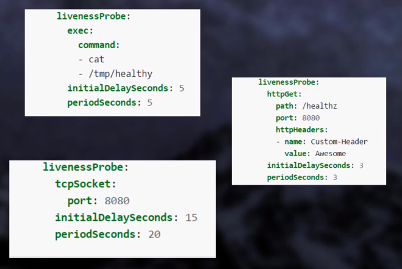

86) Some liveness probes. Take a look at **files/liveready/liveness.yaml**

  - Http checks
  - Script checks on bash
  - TCP socket checks

### Readiness Probes

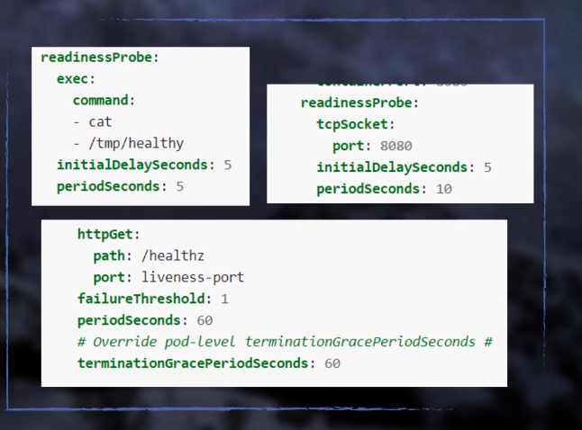

87) It is used in checking whether pod is ready to accepts traffic or not. If readiness probe is ok, pods are created and located behind Service.

### Resource Limits

88) The default CPU/RAM behavior is limitless. An example file is **files/requestlimit/requestlimit.yaml**.

```requestlimit.yaml
resources:
  requests:
    memory: "64M"
    cpu: "250m"
  limits:
    memory: "256M"
    cpu: "0.5"
```

89) **requests** flag means the required resource to create the pod. **limits** means the required resource that can be allocated to the pod if required. If a pod exceeds RAM limit, it will prompt an OOM(Out of Memory) error and pods will restart. However, the same thing isn't valid for CPU limit. Exceeding CPU Limit isn't possible.

### Environment Variables

90) We shouldn't hard-code some credentials. You should pass them via environment variables. Take a look at **files/pods/podenv.yaml**

# Kubernetes 102

### Volumes

1) Containers are suitable for stateless applications.

2) Ephemeral volumes are able to store information out of pods. 2 containers in a pod are able to access to the same ephemeral volume at the same time. It has 2 types:
  - emptyDir: It is created when a pod is allocated to a node. The folder is created randomly. It will live until pod is dead. If pod dies, its contant will be deleted permanently.
  - hostPath: Similar to emptyDir. The folder isn't random and determined before. It is useful when a pod is necessary to access to a directory on worker node. It is a nish case. Don't use it if you don't know what to do exactly.

3) In order to create a volume, it should be defined under spec. Take a look at **files/volumes/podvolumeemptydir.yaml** and **files/volumes/podvolumehostpath.yaml**.

4) If a problem occurs and a container in a pod is restarted, it means container is killed and a new container is created. However, the data in the volume is going to persist.

5) Volumes are useful between different containers of a pod.

6) We don't have to mount folders only. We can mount files too. 3 different options for hostPath volumes. Take a look at **files/volumes/podvolumehostpath.yaml**.

### Secrets

7) Secret is a k8s object too. It can be used to store username, password and ssh keys etc. Secrets are enabling us to separate applications from sensitive credentials. Secret is much more flexible than hard coding or environment variables. Secrets can be created declaratively or imperatively. When a secret is created, they are stored under etcd in the format of base64, which means they aren't encrypted. This encription is carried out by managed k8s services like AKS, EKS and GKE automatically. We can also encrypt k8s secrets on our Vanilla k8s cluster(but not covered in the course). If a user is able to create pods, that user is also able to create secrets too. All files are under **files/secretconfigmap/**. Take a look at **files/secretconfigmap/secret.yaml** for an example secret. 

8) Secrets and pods should be in the same namespace.

9) There exists 8 different secret types. Some are opaque(secret), basic authentication, docker-registry etc.

10) To list secrets, run `kubectl get secrets`.

11) To create a secret imperatively, run

```shell
# via shell
kubectl create secret generic SECRET_NAME --from-literal=db_server=db.example.com --from-literal=db_username=dbuser
# via file
kubectl create secret generic SECRET_NAME --from-file=db_server=server.txt --from-file=db_user=username.txt
# via json(having key-pair values )
kubectl create secret generic SECRET_NAME --from-file=config.json
```

12) In order to pass secrets to pods, take a look at **files/secretconfigmap/podsecret.yaml**. There are 3 ways to pass secrets to pods. All methods are exaplified in **files/secretconfigmap/podsecret.yaml**.

### ConfigMap

13) Configmap is a k8s object. Configmaps are created in the same way and used for the same purposes. If we don't have to store sensitive information, configmap is the way to go. Configmaps are used to store non-sensitive data.

14) Take a look at **files/secretconfigmap/configmap.yaml** for an example secret. 

### Node Affinity

15) It is similar to NodeSelector, which is enabling us to allocate specific pods to specific nodes. Let's assume our cluster is consisting of many nodes and some are CPU-optimized, some are RAM-optimized, some are SSD-Optimized. Thanks to Node Affinity, we can assign some pods to RAM optimized nodes and some pods to SSD optimized nodes.


16) Take a look at **files/affinity/podnodeaffinity.yaml**.

### Pod Affinity

17) It is related to selecting our pod's nodes. If we want a pod to run with another pod, we can do this via Pod Affinity. In addition to that, we can assign a pod to a node that doesn't have a specific pod etc.

18) If a FE pod is reading data from a DB pod, they should co-exist in the same AZ(Availablity Zone). We can do this via Pod Affinity.

19) Pod Affinity makes much more sense for clusters composed of many nodes.

### Taint & Toleration

20) Node affinity and pod affinity aren't enough sometimes. Therefore, we need more settings.

21) To add a taint(platform=production) to a node

```
kubectl taint node NODE_NAME platform=production:NoSchedule
```

22) To delete a taint(platform) from a node

```shell
kubectl taint node minikube platform-
```

23) If a node doesn't tolerate a pod, it will not host that pod.

24) Take a look at **files/tainttoleration/podtoleration.yaml**.

25) If we want a pod to run on a specific node, it is related to node affinity. If we want our node to run only specific pods, it is related to taint & toleration.

### DaemonSet

26) Daemonset is a k8s object. It is similar to deployment object.

27) It is enabling log collection apps & storage provisioning apps to be deployed easily. A daemonset is created and then added to existent nodes. If a node is added to the cluster, it will be added to new node too.

28) Take a look at **files/daemonset/daemonset.yaml**.

29) We can enable Daemonset to run on only some nodes.

30) To list daemonsets, trigger `kubectl get daemonset`.

### Persistent Volume(PV) & Persistent Volume Claim(PVC)

31) Ephemeral Volume isn't handy in the scenario that stores sensitive data. Let's assume we store backup of our DB on a node in a k8s cluster. When our node is down, the ephemeral volume in the node will be down too. Sensitive data is going to lose. Thus, it is required not to keep DB data in an ephemeral volume.

32) Persistent Volume comes in handy in this scenario. Persisten Volume is a k8s object. Persistent volume is a volume accessed by all nodes of a k8s cluster and it is located outside of k8s cluster. The lifetime of persisten volume will be much higher than the lifetime of ephemeral volume.

33) In order to create persistent volume, we should configure. CSI (Container Storage Interface) is used in this case. CSI is a standard of configuring k8s's storage infrastructure. Some drivers are provided in k8s.

34) Persistent Volume is visualized below

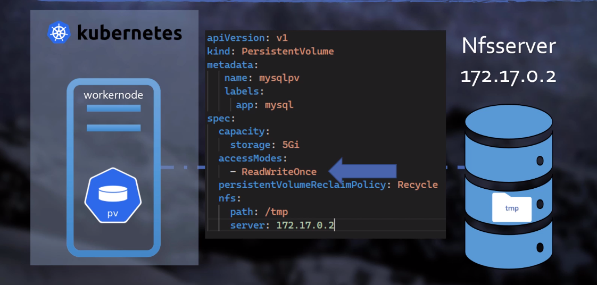

35) AWS S3 can't be linked to pods as persistent volumes. NFS Servers are generally used as persistent volumes.

36) The files are under **files/pvpvc/**.

37) To list persistent volumes

```shell
kubectl get pv
```

38) The creation of persistent volumes are made by System Engineers. Their usage is carried out by developers.

39) Pv's are attached to pvc's. Pvc's are attached to pods.

### StorageClass(SC)

40) It is an alternative to Persistent Volume. It is similar to automation of pv's. It is a recipe. Developers use StorageClass as a template to create persistent volumes. Cloud Service Providers are serving storageclass in an automatic way.

41) To list storageclasses

```shell
kubectl get storageclass
```

42) The files are under **files/storageclass/**.

43) System Admins create storageclasses for different purposes: (cpu optimized, ram optimized etc.)

### StatefulSet

44) It is a k8s object. It is solving the dockerization problem of master-slave applications. It is similar to deployment.

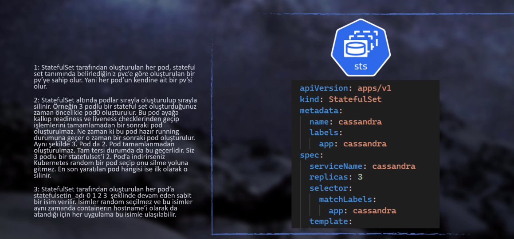

45) Statefulset is used in pods of cassandra, mongodb etc.

46) The files are under **files/statefulset/**.

47) To scale number of pods created by statefulset 

```shell
kubectl scale statefulset POD_NAME --replicas=3
```

48) Headless service is used in statefulset(I didn't understand here). It enables us to access to the pods via their names one by one.

### Job

49) It is a k8s object. It creates one or multiple pods. If pod fails, pod is recreated. When a job is done, pods aren't deleted and thus logs are checked. Maintenance scripts or db scripts can be implemented with job.

50) Job is used in one-time tasks. Let's assume your app is connecting to an S3 bucket and getting the names of files. It isn't a regular job. Objects are accumulating a lot and then you run the job.

51) The files are under **files/jobcronjob/job.yaml**.

### Cronjob

52) It is a k8s object. It is a k8s version of crontab. It is running a job regularly.

53) The files are under **files/jobcronjob/cronjob.yaml**.

54) To list cronjobs

```shell
kubectl get cronjobs.batch
```

### Authentication

55) User creation and id verification are carried out out of k8s cluster. All of these authentication are carried out by cloud service providers.

56) Authentication ways of k8s. One of them is chose during the installation of kube api server.

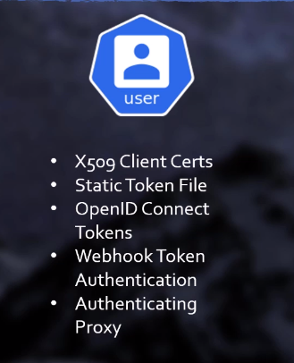

57) Minikube uses 509 Client Certificates. Kubernetes doesn't hold user objects. It extracts who we are from the certificates.

58) Developers should create private keys first and CSR files and then send these to SysAdm. CSR are files that tell us certificate providers that it needs a certificate.

```shell
# Developer runnnig the following commands
# To create private key
openssl genrsa -out file_name.key 2048
# To create a CSR file
openssl req -new -key file_name.key -out file_name.csr -subj "/CN=email@mail.com/0=DevelopmentTeam"
```

59) CertificateSigningRequest is a k8s object. It creates csr object, which is a k8s object too.The README file under **files/authentication/** is showing the necessary yaml file to create csr object.

60) To list csr objects(run by sysadmins)

```shell
kubectl get csr
```

61) To approve a csr in order to create a certificate (run by sysadmins)

```shell
kubectl certificate approve CSR_NAME
```

62) To view encoded certificate (run by sysadmins)

```shell
kubectl get csr CSR_NAME -o yaml
```

63) To get decoded certificate and dump it to a crt file (run by sysadmins). CSR_NAME.crt is sent to developer.

```shell
kubectl get csr CSR_NAME -o jsonpath='{.status.certificate}' | base64 -d >> CSR_NAME.crt 
```

64) To set credentials(run by developer)

```
kubectl config set-credentials email@mail.com --client-certiciate=CSR_NAME.crt --client-key=file_name.key
```

65) To create a new context in order to connect to a k8s cluster (run by developer)

```
kubectl config set-context NEW_CONTEXT_NAME --cluster=minikube --user=email@mail.com 
```

66) To use the above context (run by developer). Now, we are able to connect to the k8s cluster(authorization is ok) but we don't have any authorization.

```shell
kubectl config use-context NEW_CONTEXT_NAME
```

### RBAC(Role Based Access Control)

67) Authentication is not equal to Authorization. Having authentication doesn't mean having authorization. Authorization is carried out via RBAC(Role Based Access Control).

68) The relationship between role, user and role binding.

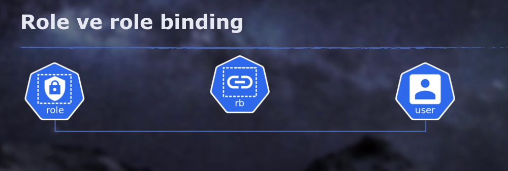

69) The files are under **files/rbac/**.

70) Role is a k8s object that has rules. An example role is **files/rbac/role.yaml**. It is used to give authorization to a namespace.

71) Clusterrole is a k8s object. It is used to give authorization to the whole cluster. It is used with non-namespace k8s objects.

72) Role binding is a k8s object. It is used in binding a role to a user.

73) Cluster role binding is a k8s object. It is used in binding a clusterrole to a non-namespace k8s object.

74) If we want to equip a user with administrator role, bind cluster-role to that user.


### Service Account

75) Service Account is a k8s object. It is necessary for a pod to communicate with API server. Service Account is used in this scenario.

76) Service Account is the only k8s object thaat is an account. It isn't used by people. It is used by apps.

77) The files are under **files/serviceaccount/**.

78) To list service accounts, trigger `kubectl get sa`.

### Ingress

79) Let's assume 2 have websites as **example.com** from app 1 and **example.com/contact**. Both have the same domain name but served from differnt applications. A load balancer on OSI layer 4 doesn't work well for this circumstance. Thus, we need a load balancer at OSI layer 7. We solve this problem via ingress controller and ingress objects.

80) **Ingress controller** is a layer 7 application loadbalancer for k8s. Nginx, Traefik & HAproxy are some examples. We install ingress controller on k8s cluster. If we work on cloud, this ingress controller is published to the internet via an LB and we get a public IP address. Ingress controller makes path-based routing.

81) **Ingress object**s are directing requests to relevant pods. Ingress is a k8s object. Ingress controllers are taking ingress objects into consideration and sending requests to relevant pods. To list ingress objects, run `kubectl get ingress -A`.

82) Run minikube via `minikube start --driver=hyperv` for the practice.

83) To list addons on minikube `minikube addons list`.

84) To enable ingress on `minikube addons enable ingress`.

85) All files are under **files/ingress/**.

86) Load Balancer & Ingress & Service & Pod


87) The documentation is [here](https://kubernetes.io/docs/concepts/services-networking/ingress/).

88) In order to configure ingress controller, we modify annotations on **files/ingress/appingress.yaml**

89) In order to run multiple urls on a single IP, we should use ingress and ingress controller(NGINX).

### Project

90) The solution of the project is under **files/proje**

91) Let's assume 2 have deployments. One is DB, the other is a wordpress application. Wordpress app will read data from DB. In order for wordpress to read data from DB, we should create a k8s service object in the type of ClusterIP for DB and provide it for wordpress.

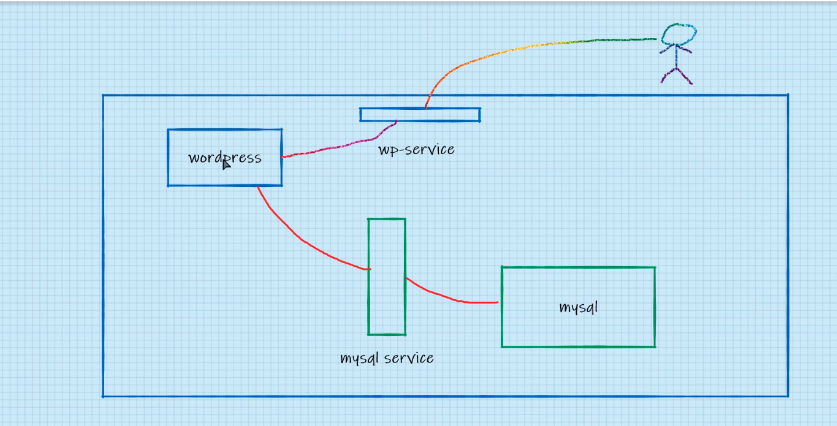

92) In order for wordpress to be exposed to the internet, there are 3 ways:
  - A service in the type of nodeport
  - A service in the type of load balancder
  - Ingress

93) [jwt.io](https://jwt.io) is a website to encode and decode json web tokens.

94) In order to delete all pods on a node

```shell
# local data means emptydir volumes etc.
# to evict all pods
kubectl drain NODE_NAME --ignore-daemonsets --delete-local-data
# to prevent pods from being scheduled on the node
kubectl cordon NODE_NAME
# to enable the node to accept pods
kubectl uncordon NODE_NAME
```

# Extras

### Dashboard

1) Official dashboard of k8s is [here](https://github.com/kubernetes/dashboard).

2) Prefer using CLI over using Dashboard.

3) It can be installed on a remote k8s cluster via a yaml file. If we want to install it on minikube cluster, it is available as an add-on via `minikube addons enable dashboard`. It is also recommended to install metrics-server via `minikube addons enable metrics-server`. To run dashboard `minikube dashboard`.

4) On dashboard, we can write a yaml file or upload a yaml file or fill out a form in order to create k8 objects.

5) [Lens](https://k8slens.dev/) is an alternative to default dashboard. It is a 3rd party solution. We can have multiple different clusters on Lens. Lens isn't installed on k8s cluster. It is installed on a local machine.

6) [Headlamp](https://github.com/headlamp-k8s/headlamp) is another alternative to default dashboard.

### ImagePullPolicy and Image Secret

7) The files are under **files/imagesecret/**.

8) We don't publish our Docker images in a real-life scenario.

9) 3 fields required: name, password and url. We create k8s secrets in the format of docker-registry using `kubectl create secret docker-registry DOCKER_REGISTRY_SECRET_NAME --docker-server=FILL_HERE --docker-username=FILL_HERE --docker-pasword=FILL_HERE` and pass these secrets to a yaml file. Take a look at **files/imagesecret/README.md**.

10) **imagePullPolicy** can have one of 3 values: **Always**, **IfNotPresent**, **Never**.  It is under containers key in the yaml file. Take a look at **files/imagesecret/podwithsecret.yaml**. If we are using a latest image, k8s defaults **imagePullPolicy** to Always.

### StaticPod

11) If we want to create pods via kubelet instead of sending a yaml file to API server, static pod is the way to go. Static pod isn't used in real life a lot. Static pod

12) [Here](https://kubernetes.io/docs/tasks/configure-pod-container/static-pod/) is showing us what to do.

13) We put yaml files under /etcd/kubernetes/manifests in master node and these yaml files will be triggered by kubelet.

14) If want to create a static pod, put a yaml file under __/etcd/kubernetes/manifests__ and kubelet wil read that file and create a pod.

### Network Policy

15) Some reminders of k8s networking by default:

  - Each pod should have a unique IP.
  - Each pod should communicate with each other without NAT and irrespective of namespaces.
  - Each pod should access to where the VM accesses.
  - Each pod can be public to the outer world if it published to the outer world via ingress, nodeport service or loadbalancder service.

16) There might be required to restrict pod accesses. For instance, we want a frontend pod to access to a backend node only. These restictions may cover IP or namespaces.

17) NetworkPolicy is a k8s object.

18) The files are under **files/networkpolicy/**. To view an example network policy file, look at **policy.yaml**.

19) Restrictions can be over ip, namespace and pod.

20) There can be multiple NetworkPolicies assigned to a single pod. The rules of multiple network policies are merged.

21) If you want to use Network policies, you should use a CNI that supports network policies. The default of Minikube doesn't support network policies. Thus, it is required to use a CNI like calico, which supports network policies.


